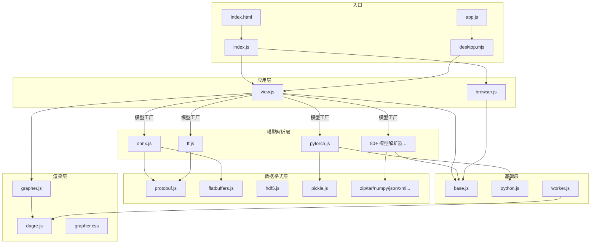

# Netron Source Code 架构分析

> 本文档分析 `netron-ori/source` 文件夹中的 170 个文件的功能与相互关系。

## 目录

- [总体架构](#总体架构)
- [核心模块](#核心模块)
- [模型格式解析器](#模型格式解析器)
- [序列化与数据格式支持](#序列化与数据格式支持)
- [前端资源](#前端资源)
- [模块关系图](#模块关系图)

---

## 总体架构

Netron 是一个用于可视化神经网络、深度学习和机器学习模型的开源工具。它支持浏览器和 Electron 桌面两种运行环境，采用纯 JavaScript 编写，使用 SVG 渲染计算图。

```
┌─────────────────────────────────────────────────────┐
│                    用户界面层                         │
│  index.html (页面骨架)  │  grapher.css (图形样式)      │
├─────────────────────────────────────────────────────┤
│                   应用控制层                          │
│  view.js (视图控制器)  │  browser.js / desktop.mjs    │
│  index.js (模块加载器)  │  app.js (Electron 主进程)    │
├─────────────────────────────────────────────────────┤
│                   图形渲染层                          │
│  grapher.js (SVG 图形构建)  │  dagre.js (自动布局引擎)  │
├─────────────────────────────────────────────────────┤
│                   模型解析层                          │
│  onnx.js, pytorch.js, tf.js, caffe.js, ...          │
│  (50+ 模型格式解析器)                                │
├─────────────────────────────────────────────────────┤
│                 数据格式支持层                         │
│  protobuf.js, flatbuffers.js, json.js, xml.js, ...  │
│  zip.js, tar.js, hdf5.js, numpy.js, pickle.js       │
├─────────────────────────────────────────────────────┤
│                   基础工具层                          │
│  base.js (二进制流、元数据、遥测)                      │
│  python.js (Python AST 解析)                         │
└─────────────────────────────────────────────────────┘
```

---

## 核心模块

### 入口与启动

| 文件 | 功能 |
|------|------|
| `index.html` | 页面骨架，定义 SVG 画布、工具栏、侧栏、欢迎页等 DOM 结构，并嵌入 CSS 样式 |
| `index.js` | 浏览器端模块加载器，按依赖层级顺序动态加载 JS 模块，最终创建 `browser.Host` 和 `view.View` 实例 |
| `app.js` | Electron 主进程，管理窗口生命周期、IPC 通信、菜单构建、自动更新 |
| `desktop.mjs` | Electron 预加载脚本 (preload)，建立渲染进程与主进程之间的安全通信桥梁 |

### 视图与宿主

| 文件 | 功能 |
|------|------|
| `view.js` | **核心控制器** (~7900 行)，包含：`view.View` (主视图管理)、`view.Graph` (将模型数据映射到图形节点/边)、`view.ModelFactoryService` (模型格式识别与懒加载)、侧栏面板、搜索、导出等 |
| `browser.js` | 浏览器宿主环境 (`browser.Host`)，实现文件打开、拖拽、URL 加载、cookie/localStorage 管理、遥测、消息对话框等 |

### 图形渲染

| 文件 | 功能 |
|------|------|
| `grapher.js` | SVG 图形引擎，定义 `grapher.Graph` (复合图结构)、`grapher.Node` (节点渲染)、`grapher.Edge` (边渲染，含贝塞尔曲线)、`grapher.Argument` (节点属性列表) |
| `grapher.css` | 图形样式（节点边框、边颜色、选中高亮、箭头标记、暗色模式适配等） |
| `dagre.js` | 有向图自动布局引擎 (Dagre 算法的纯 JS 实现)，含排序、分层、交叉最小化、坐标分配 |

### 基础设施

| 文件 | 功能 |
|------|------|
| `base.js` | 核心工具库：`BinaryStream` (二进制流读取)、`Metadata` (支持的文件扩展名注册表)、`Telemetry` (GA 遥测)、`Complex`、`Tensor` 等 |
| `python.js` | Python AST 解析器，用于解析 PyTorch 的 TorchScript (`code/*.py`) |
| `message.js` | 消息/通知管理 |
| `worker.js` | Web Worker 入口，用于在后台线程执行 dagre 布局计算 |
| `node.js` | Node.js 环境入口 |

---

## 模型格式解析器

Netron 支持 50+ 种模型格式。每种格式通常由以下文件组成：

- **`<format>.js`** — 模型解析器（定义 Model、Graph、Node、Tensor 等类）
- **`<format>-metadata.json`** — 算子元数据（名称、属性说明、输入输出定义）
- **`<format>-proto.js`** / **`<format>-schema.js`** — Protocol Buffers 或 FlatBuffers 的 schema 定义

### 主流框架格式

| 格式 | 文件 | 说明 |
|------|------|------|
| **ONNX** | `onnx.js`, `onnx-proto.js`, `onnx-schema.js`, `onnx-metadata.json`, `onnx.py` | Open Neural Network Exchange |
| **PyTorch** | `pytorch.js`, `pytorch-proto.js`, `pytorch-schema.js`, `pytorch-metadata.json`, `pytorch.py` | TorchScript/ExportedProgram/safetensors |
| **TensorFlow** | `tf.js`, `tf-proto.js`, `tf-metadata.json` | SavedModel / GraphDef / Frozen Graph |
| **TFLite** | `tflite.js`, `tflite-schema.js`, `tflite-metadata.json` | TensorFlow Lite |
| **Keras** | `keras.js`, `keras-proto.js`, `keras-metadata.json` | Keras 模型 (HDF5/JSON) |
| **CoreML** | `coreml.js`, `coreml-proto.js`, `coreml-metadata.json` | Apple Core ML |
| **Caffe** | `caffe.js`, `caffe-proto.js`, `caffe-metadata.json` | Caffe prototxt/caffemodel |
| **Caffe2** | `caffe2.js`, `caffe2-proto.js`, `caffe2-metadata.json` | Caffe2 / ONNX后端 |
| **MXNet** | `mxnet.js`, `mxnet-metadata.json` | Apache MXNet |
| **PaddlePaddle** | `paddle.js`, `paddle-proto.js`, `paddle-schema.js`, `paddle-metadata.json` | 百度 PaddlePaddle |

### 推理引擎格式

| 格式 | 文件 | 说明 |
|------|------|------|
| **OpenVINO** | `openvino.js`, `openvino-metadata.json` | Intel OpenVINO IR |
| **TensorRT** | `tensorrt.js` | NVIDIA TensorRT |
| **NCNN** | `ncnn.js`, `ncnn-metadata.json` | 腾讯 NCNN |
| **MNN** | `mnn.js`, `mnn-schema.js`, `mnn-metadata.json` | 阿里 MNN |
| **TNN** | `tnn.js`, `tnn-metadata.json` | 腾讯 TNN |
| **MindSpore Lite** | `mslite.js`, `mslite-schema.js`, `mslite-metadata.json` | 华为 MindSpore Lite |
| **RKNN** | `rknn.js`, `rknn-schema.js`, `rknn-metadata.json` | Rockchip RKNN |
| **ArmNN** | `armnn.js`, `armnn-schema.js`, `armnn-metadata.json` | Arm NN |
| **DLC** | `dlc.js`, `dlc-schema.js`, `dlc-metadata.json` | Qualcomm DLC |
| **QNN** | `qnn.js`, `qnn-metadata.json` | Qualcomm QNN |
| **Barracuda** | `barracuda.js` | Unity Barracuda |
| **Acuity** | `acuity.js`, `acuity-metadata.json` | VeriSilicon Acuity |
| **Hailo** | `hailo.js`, `hailo-metadata.json` | Hailo |
| **OneDNN** | `onednn.js`, `onednn-metadata.json` | Intel oneDNN Graph |
| **ExecuteTorch** | `executorch.js`, `executorch-schema.js` | Meta ExecuTorch |
| **Tengine** | `tengine.js`, `tengine-metadata.json` | OPEN AI LAB Tengine |
| **KModel** | `kmodel.js` | 嘉楠 KModel |
| **ESPDL** | `espdl.js`, `espdl-schema.js`, `espdl-metadata.json` | 乐鑫 ESP-DL |
| **MegEngine** | `megengine.js`, `megengine-schema.js`, `megengine-metadata.json` | 旷视 MegEngine |
| **OM** | `om.js`, `om-proto.js`, `om-metadata.json` | 华为昇腾 OM |
| **Kann** | `kann.js`, `kann-schema.js`, `kann-metadata.json` | STMicro KANN |

### 其他格式

| 格式 | 文件 | 说明 |
|------|------|------|
| **Darknet** | `darknet.js`, `darknet-metadata.json` | YOLO/Darknet 配置 |
| **CNTK** | `cntk.js`, `cntk-proto.js`, `cntk-metadata.json` | Microsoft CNTK |
| **DL4J** | `dl4j.js`, `dl4j-metadata.json` | Deeplearning4j |
| **BigDL** | `bigdl.js`, `bigdl-proto.js`, `bigdl-metadata.json` | Intel BigDL |
| **NNabla** | `nnabla.js`, `nnabla-proto.js`, `nnabla-metadata.json` | Sony NNabla |
| **MLIR** | `mlir.js`, `mlir-metadata.json` | LLVM MLIR (最大单文件 1MB+) |
| **Torch (legacy)** | `torch.js`, `torch-metadata.json` | Lua Torch 7 |
| **UFF** | `uff.js`, `uff-proto.js`, `uff-metadata.json` | UFF (Universal Framework Format) |
| **DNN** | `dnn.js`, `dnn-proto.js`, `dnn-metadata.json` | CEVA DNN |
| **XModel** | `xmodel.js`, `xmodel-proto.js` | Xilinx Vitis AI |
| **DOT** | `dot.js` | Graphviz DOT 格式 |
| **Flax** | `flax.js` | Google Flax (JAX) |
| **Flux** | `flux.js`, `flux-metadata.json` | Julia Flux |
| **GGUF** | `gguf.js`, `gguf-metadata.json` | GGML/llama.cpp |
| **Espresso** | `espresso.js`, `espresso-metadata.json` | Apple Espresso |
| **NNC** | `nnc.js` | Samsung NNC |
| **NNEF** | `nnef.js` | Khronos NNEF |
| **ML.NET** | `mlnet.js`, `mlnet-metadata.json` | Microsoft ML.NET |
| **TVM** | `tvm.js` | Apache TVM Relay |
| **Circle** | `circle.js`, `circle-schema.js`, `circle-metadata.json` | Samsung ONE Circle |
| **TOSA** | `tosa.js`, `tosa-schema.js`, `tosa-metadata.json` | Arm TOSA |
| **Transformers** | `transformers.js` | HuggingFace 配置 |
| **SentencePiece** | `sentencepiece.js`, `sentencepiece-proto.js` | SentencePiece tokenizer |
| **MediaPipe** | `mediapipe.js` | Google MediaPipe |
| **ImgDNN** | `imgdnn.js` | Imagination Technologies |

### 传统 ML 模型格式

| 格式 | 文件 | 说明 |
|------|------|------|
| **scikit-learn** | `sklearn.js`, `sklearn-metadata.json` | Python scikit-learn (pickle) |
| **XGBoost** | `xgboost.js` | XGBoost |
| **LightGBM** | `lightgbm.js` | LightGBM |
| **CatBoost** | `catboost.js` | CatBoost |
| **Weka** | `weka.js` | Java Weka |
| **Lasagne** | `lasagne.js`, `lasagne-metadata.json` | Theano/Lasagne |
| **SafeTensors** | `safetensors.js` | HuggingFace safetensors |
| **Hickle** | `hickle.js` | Hickle (HDF5 pickle) |

---

## 序列化与数据格式支持

这些模块为上层模型解析器提供数据读取能力：

| 文件 | 功能 |
|------|------|
| `protobuf.js` | Protocol Buffers 二进制和文本格式解析 |
| `flatbuffers.js` | FlatBuffers 读取器 |
| `flexbuffers.js` | FlexBuffers 读取器 |
| `json.js` | JSON 格式模型解析（通用 JSON 图结构、Keras JSON 等） |
| `xml.js` | XML 解析器（供 OpenVINO IR 等使用） |
| `text.js` | 文本格式解析（Caffe prototxt 等） |
| `hdf5.js` | HDF5 文件格式读取器 |
| `numpy.js` | NumPy `.npy`/`.npz` 读取器 |
| `pickle.js` | Python pickle 反序列化 |
| `zip.js` | ZIP 解压 (PK/ZIP64) |
| `tar.js` | TAR 归档读取 |

---

## 前端资源

| 文件 | 功能 |
|------|------|
| `favicon.ico` | 网站图标 |
| `icon.png` | 应用图标 |

---

## 模块关系图



### 数据流

1. **加载** → `browser.js`/`desktop.mjs` 接收文件 → 传递给 `view.js`
2. **识别** → `view.ModelFactoryService` 根据文件扩展名/内容识别格式
3. **解析** → 动态导入对应的 `<format>.js` 模块，使用序列化库读取文件
4. **映射** → `view.Graph` 将模型 Graph/Node/Edge 映射为 `grapher.Graph`
5. **布局** → `dagre.js` (或 Web Worker) 计算节点坐标
6. **渲染** → `grapher.js` 生成 SVG 元素到 `index.html` 的画布中
7. **交互** → `view.js` 处理缩放、平移、选择、搜索、导出等用户交互

---

## 文件统计

- **总计**: 170 个文件
- **JS 模块**: ~130 个 `.js` 文件
- **元数据 JSON**: ~35 个 `-metadata.json` 文件
- **其他**: `index.html`, `grapher.css`, 2 个 `.py` 文件, 图标文件
- **最大文件**: `mlir-metadata.json` (~8.6MB), `python.js` (~1.1MB), `mlir.js` (~1MB)
